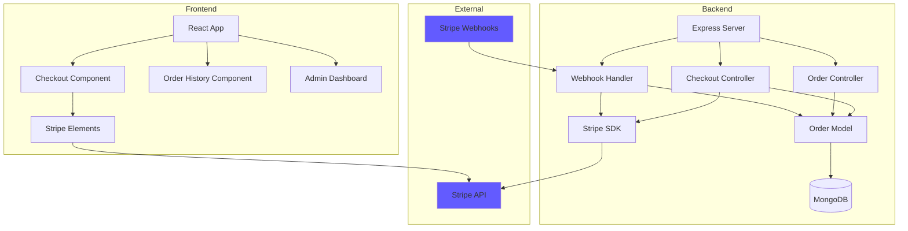
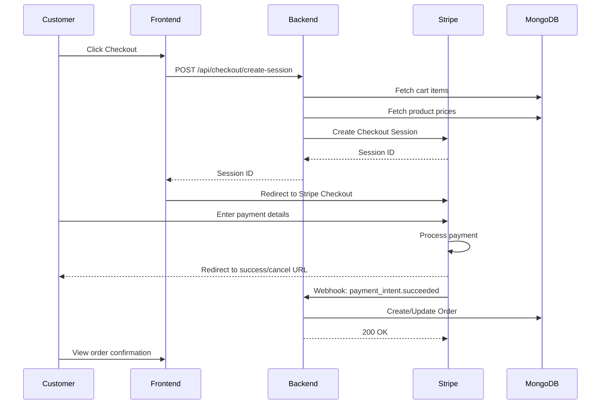
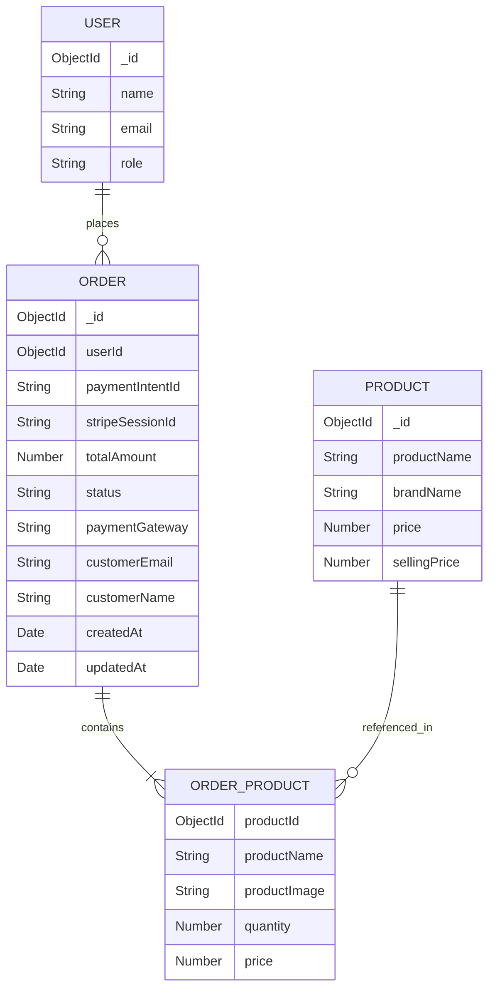

# Design Document: Payment Gateway Integration

## Overview

This design document specifies the technical implementation for integrating Stripe payment gateway into the MERN stack e-commerce application. The integration enables secure payment processing, order creation, webhook handling for payment status updates, and comprehensive order management for both customers and administrators.

### Key Design Goals

1. **Security**: Implement secure payment processing using Stripe's hosted checkout, ensuring PCI compliance by never handling raw card data
2. **Reliability**: Use Stripe webhooks for authoritative payment status updates with idempotent order creation
3. **User Experience**: Provide clear payment flow with appropriate error handling and status feedback
4. **Maintainability**: Follow existing codebase patterns for controllers, routes, and models

### Technology Stack

- **Backend**: Node.js with Express, Stripe Node SDK (`stripe` npm package)
- **Frontend**: React with Stripe.js and React Stripe Elements (`@stripe/stripe-js`, `@stripe/react-stripe-js`)
- **Database**: MongoDB with Mongoose ODM
- **Authentication**: JWT tokens (existing implementation)
- **State Management**: Redux Toolkit (existing implementation)

### Integration Approach

We will use **Stripe Checkout Sessions** for payment processing, which provides:
- Hosted payment page with built-in security
- Automatic PCI compliance
- Support for multiple payment methods
- Built-in fraud prevention
- Webhook notifications for payment events

## Architecture

### High-Level Architecture



### Payment Flow Sequence



### Component Interaction

1. **Checkout Flow**:
   - Frontend initiates checkout → Backend creates Stripe session → Customer redirected to Stripe → Payment processed → Webhook updates order

2. **Order Creation**:
   - Webhook receives payment success → Validate signature → Create order with payment intent ID → Clear cart → Update order status

3. **Order Retrieval**:
   - Customer/Admin requests orders → Backend validates authentication → Query MongoDB → Return order data

### Security Layers

1. **API Security**: JWT authentication on all checkout and order endpoints
2. **Webhook Security**: Stripe signature verification using webhook secret
3. **Payment Security**: Stripe handles all payment data (PCI compliant)
4. **Amount Validation**: Server-side price calculation from database (never trust client)
5. **Idempotency**: Payment intent ID prevents duplicate orders

## Components and Interfaces

### Backend Components

#### 1. Order Model (`Backend/models/orderModel.js`)

**Purpose**: Define MongoDB schema for order storage

**Schema**:
```javascript
{
  userId: ObjectId (ref: 'user'),
  paymentIntentId: String (unique, indexed),
  products: [{
    productId: ObjectId (ref: 'Product'),
    productName: String,
    productImage: String,
    quantity: Number,
    price: Number
  }],
  totalAmount: Number,
  status: String (enum: ['pending', 'paid', 'failed', 'refunded']),
  paymentGateway: String (default: 'stripe'),
  stripeSessionId: String,
  customerEmail: String,
  customerName: String,
  shippingAddress: Object (optional for future),
  createdAt: Date,
  updatedAt: Date
}
```

**Indexes**:
- `paymentIntentId`: Unique index for idempotency
- `userId`: Index for customer order queries
- `status`: Index for admin filtering
- `createdAt`: Index for sorting

#### 2. Checkout Controller (`Backend/controller/payment/checkoutController.js`)

**Purpose**: Handle checkout session creation

**Functions**:

```javascript
createCheckoutSession(req, res)
```
- **Input**: JWT token (from authToken middleware), userId from req.userId
- **Process**:
  1. Fetch user's cart items from database
  2. Validate cart is not empty
  3. Fetch current product prices from Product model
  4. Calculate total amount server-side
  5. Create Stripe checkout session with line items
  6. Return session ID to frontend
- **Output**: `{ success: true, sessionId: string, sessionUrl: string }`
- **Error Handling**: Return appropriate error messages for empty cart, invalid products, Stripe API errors

```javascript
checkoutSuccess(req, res)
```
- **Input**: `session_id` query parameter
- **Process**:
  1. Retrieve session from Stripe
  2. Verify payment status
  3. Return order details
- **Output**: `{ success: true, order: object }`

```javascript
checkoutCancel(req, res)
```
- **Input**: None
- **Process**: Log cancellation
- **Output**: `{ success: true, message: 'Checkout cancelled' }`

#### 3. Webhook Handler (`Backend/controller/payment/webhookController.js`)

**Purpose**: Process Stripe webhook events

**Functions**:

```javascript
handleStripeWebhook(req, res)
```
- **Input**: Raw request body, Stripe signature header
- **Process**:
  1. Verify webhook signature using Stripe SDK
  2. Parse event type
  3. Handle event based on type:
     - `checkout.session.completed`: Create order, clear cart
     - `payment_intent.succeeded`: Update order status to 'paid'
     - `payment_intent.payment_failed`: Update order status to 'failed'
     - `charge.refunded`: Update order status to 'refunded'
  4. Use payment intent ID for idempotency
  5. Log all events
- **Output**: `200 OK` or `400/401` for errors
- **Error Handling**: Return 401 for invalid signatures, log errors for debugging

**Event Handlers**:

```javascript
handleCheckoutSessionCompleted(session)
```
- Create order record
- Store product snapshot (name, price, image)
- Clear user's cart
- Set status to 'pending' (will be updated by payment_intent.succeeded)

```javascript
handlePaymentIntentSucceeded(paymentIntent)
```
- Find order by payment intent ID
- Update status to 'paid'
- Log success

```javascript
handlePaymentIntentFailed(paymentIntent)
```
- Find or create order by payment intent ID
- Update status to 'failed'
- Log failure reason

```javascript
handleChargeRefunded(charge)
```
- Find order by payment intent ID
- Update status to 'refunded'
- Log refund details

#### 4. Order Controller (`Backend/controller/order/orderController.js`)

**Purpose**: Manage order retrieval and queries

**Functions**:

```javascript
getUserOrders(req, res)
```
- **Input**: JWT token, userId from req.userId
- **Process**:
  1. Query orders by userId
  2. Sort by createdAt descending
  3. Populate product details
- **Output**: `{ success: true, orders: array }`

```javascript
getAllOrders(req, res)
```
- **Input**: JWT token, admin role verification
- **Process**:
  1. Verify user is admin
  2. Query all orders
  3. Populate user and product details
  4. Support filtering by status (query param)
  5. Support search by customer email/name (query param)
- **Output**: `{ success: true, orders: array, total: number }`

```javascript
getOrderById(req, res)
```
- **Input**: orderId parameter, JWT token
- **Process**:
  1. Fetch order by ID
  2. Verify user owns order OR user is admin
  3. Populate full details
- **Output**: `{ success: true, order: object }`

#### 5. Stripe Service (`Backend/services/stripeService.js`)

**Purpose**: Centralize Stripe SDK interactions

**Functions**:

```javascript
initializeStripe()
```
- Initialize Stripe client with secret key from environment
- Export configured instance

```javascript
createCheckoutSession(lineItems, metadata, successUrl, cancelUrl)
```
- Create Stripe checkout session
- Configure payment methods
- Set metadata for order tracking
- Return session object

```javascript
retrieveSession(sessionId)
```
- Retrieve session details from Stripe
- Return session object

```javascript
constructWebhookEvent(payload, signature, secret)
```
- Verify and construct webhook event
- Throw error if signature invalid
- Return event object

### Backend Routes (`Backend/routes/index.js`)

Add the following routes:

```javascript
// Payment routes
router.post('/checkout/create-session', authToken, createCheckoutSession)
router.get('/checkout/success', authToken, checkoutSuccess)
router.get('/checkout/cancel', authToken, checkoutCancel)
router.post('/webhook/stripe', express.raw({type: 'application/json'}), handleStripeWebhook)

// Order routes
router.get('/orders/user', authToken, getUserOrders)
router.get('/orders/all', authToken, getAllOrders)
router.get('/orders/:orderId', authToken, getOrderById)
```

**Note**: The webhook route must use `express.raw()` middleware to preserve raw body for signature verification.

### Frontend Components

#### 1. Checkout Component (`frontend/src/components/Checkout.js`)

**Purpose**: Initiate checkout process

**Props**: None (uses Redux state for cart)

**State**:
- `loading`: Boolean for checkout initiation
- `error`: String for error messages

**Functions**:

```javascript
handleCheckout()
```
- Dispatch action to create checkout session
- Redirect to Stripe checkout URL on success
- Display error message on failure

**UI Elements**:
- Checkout button
- Loading spinner
- Error message display
- Cart summary

#### 2. Checkout Success Component (`frontend/src/pages/CheckoutSuccess.js`)

**Purpose**: Display order confirmation after successful payment

**Props**: None (reads session_id from URL params)

**State**:
- `order`: Object with order details
- `loading`: Boolean

**Functions**:

```javascript
useEffect(() => fetchOrderDetails())
```
- Extract session_id from URL
- Call backend to get order details
- Display order confirmation

**UI Elements**:
- Success message
- Order summary
- Order ID
- Product list
- Total amount
- Link to order history

#### 3. Checkout Cancel Component (`frontend/src/pages/CheckoutCancel.js`)

**Purpose**: Handle cancelled checkout

**UI Elements**:
- Cancellation message
- Link back to cart
- Option to retry checkout

#### 4. Order History Component (`frontend/src/pages/OrderHistory.js`)

**Purpose**: Display customer's order history

**State**:
- `orders`: Array of order objects
- `loading`: Boolean
- `error`: String

**Functions**:

```javascript
useEffect(() => fetchOrders())
```
- Fetch user's orders from backend
- Display in reverse chronological order

**UI Elements**:
- Order list with cards/table
- Order details (date, status, total, products)
- Status badges (paid, pending, failed, refunded)
- View details button

#### 5. Admin Orders Component (`frontend/src/pages/AdminOrders.js`)

**Purpose**: Admin dashboard for order management

**State**:
- `orders`: Array of all orders
- `loading`: Boolean
- `filters`: Object (status, search)
- `error`: String

**Functions**:

```javascript
useEffect(() => fetchAllOrders())
```
- Fetch all orders (admin only)
- Apply filters

```javascript
handleFilterChange(filterType, value)
```
- Update filter state
- Refetch orders with filters

```javascript
handleSearch(searchTerm)
```
- Search by customer email/name
- Update order list

**UI Elements**:
- Data table with columns: Order ID, Customer, Date, Total, Status, Actions
- Filter dropdown for status
- Search input for customer
- Pagination (future enhancement)
- View details button per order

### Frontend Redux Slices

#### Payment Slice (`frontend/src/store/paymentSlice.js`)

**State**:
```javascript
{
  sessionId: null,
  sessionUrl: null,
  loading: false,
  error: null
}
```

**Actions**:
- `createCheckoutSession`: Async thunk to call backend
- `resetPaymentState`: Clear payment state

#### Order Slice (`frontend/src/store/orderSlice.js`)

**State**:
```javascript
{
  userOrders: [],
  allOrders: [],
  currentOrder: null,
  loading: false,
  error: null
}
```

**Actions**:
- `fetchUserOrders`: Async thunk for customer orders
- `fetchAllOrders`: Async thunk for admin orders
- `fetchOrderById`: Async thunk for single order
- `clearOrders`: Reset order state

### API Endpoints Summary

| Method | Endpoint | Auth | Purpose |
|--------|----------|------|---------|
| POST | `/api/checkout/create-session` | JWT | Create Stripe checkout session |
| GET | `/api/checkout/success` | JWT | Get order details after payment |
| GET | `/api/checkout/cancel` | JWT | Handle checkout cancellation |
| POST | `/api/webhook/stripe` | Signature | Receive Stripe webhook events |
| GET | `/api/orders/user` | JWT | Get authenticated user's orders |
| GET | `/api/orders/all` | JWT + Admin | Get all orders (admin only) |
| GET | `/api/orders/:orderId` | JWT | Get specific order details |

## Data Models

### Order Model Schema

```javascript
const mongoose = require('mongoose');

const orderSchema = new mongoose.Schema({
  userId: {
    type: mongoose.Schema.Types.ObjectId,
    ref: 'user',
    required: true,
    index: true
  },
  paymentIntentId: {
    type: String,
    required: true,
    unique: true,
    index: true
  },
  stripeSessionId: {
    type: String,
    required: true
  },
  products: [{
    productId: {
      type: mongoose.Schema.Types.ObjectId,
      ref: 'Product',
      required: true
    },
    productName: {
      type: String,
      required: true
    },
    productImage: {
      type: String,
      required: true
    },
    quantity: {
      type: Number,
      required: true,
      min: 1
    },
    price: {
      type: Number,
      required: true,
      min: 0
    }
  }],
  totalAmount: {
    type: Number,
    required: true,
    min: 0
  },
  status: {
    type: String,
    enum: ['pending', 'paid', 'failed', 'refunded'],
    default: 'pending',
    index: true
  },
  paymentGateway: {
    type: String,
    default: 'stripe'
  },
  customerEmail: {
    type: String,
    required: true
  },
  customerName: {
    type: String,
    required: true
  }
}, {
  timestamps: true
});

// Compound index for admin queries
orderSchema.index({ status: 1, createdAt: -1 });

// Text index for search functionality
orderSchema.index({ customerEmail: 'text', customerName: 'text' });

const orderModel = mongoose.model('Order', orderSchema);

module.exports = orderModel;
```

### Data Model Relationships



### Data Validation Rules

1. **Order Creation**:
   - `totalAmount` must be positive
   - `products` array must not be empty
   - Each product `quantity` must be positive integer
   - Each product `price` must be non-negative
   - `paymentIntentId` must be unique (enforced by unique index)

2. **Status Transitions**:
   - `pending` → `paid` (on successful payment)
   - `pending` → `failed` (on payment failure)
   - `paid` → `refunded` (on refund)
   - Invalid transitions should be logged but not blocked (webhook may arrive out of order)

3. **Price Integrity**:
   - Product prices in order are snapshots at purchase time
   - Total amount must equal sum of (quantity × price) for all products
   - Validation performed in webhook handler

## Correctness Properties

*A property is a characteristic or behavior that should hold true across all valid executions of a system—essentially, a formal statement about what the system should do. Properties serve as the bridge between human-readable specifications and machine-verifiable correctness guarantees.*

### Property 1: Cart Validation

*For any* checkout request, if the cart is empty, the checkout SHALL be rejected with an appropriate error message; if the cart contains at least one product, validation SHALL pass.

**Validates: Requirements 2.1**

### Property 2: Server-Side Price Calculation

*For any* checkout request with cart items, the total amount SHALL be calculated from current product prices in the database, not from client-provided prices, and SHALL equal the sum of (database price × quantity) for all cart items.

**Validates: Requirements 2.3, 9.1, 9.2**

### Property 3: Error Response Format

*For any* validation failure during checkout, the system SHALL return an error response containing a descriptive message explaining the specific validation failure.

**Validates: Requirements 2.6**

### Property 4: Order Creation on Payment Success

*For any* successful payment webhook event, an order record SHALL be created in the database with the payment intent ID.

**Validates: Requirements 4.1**

### Property 5: Order Field Completeness

*For any* created order, all required fields SHALL be populated: userId, paymentIntentId, products array (with productId, productName, productImage, quantity, price for each), totalAmount, status, paymentGateway, customerEmail, customerName, and timestamps.

**Validates: Requirements 4.2, 7.3, 8.3, 11.1**

### Property 6: Cart Clearing After Order

*For any* successful order creation, the customer's cart SHALL be cleared (empty) after the order is created.

**Validates: Requirements 4.4**

### Property 7: Webhook Signature Verification

*For any* incoming webhook request, the signature SHALL be verified using the Stripe SDK, and requests with invalid signatures SHALL be rejected with HTTP 401.

**Validates: Requirements 5.2**

### Property 8: New Session on Retry

*For any* payment retry request, a new unique checkout session ID SHALL be generated, different from the previous failed session.

**Validates: Requirements 6.4**

### Property 9: Cart Preservation on Failure

*For any* failed payment, the customer's cart contents SHALL remain unchanged (not cleared).

**Validates: Requirements 6.5**

### Property 10: Chronological Order Sorting

*For any* set of orders returned to a customer, the orders SHALL be sorted by creation date in descending order (newest first).

**Validates: Requirements 7.2**

### Property 11: Admin Role Authorization

*For any* request to the admin orders endpoint, access SHALL be granted only if the authenticated user has administrator role; non-admin users SHALL receive HTTP 403 Forbidden.

**Validates: Requirements 8.2**

### Property 12: Search Filtering

*For any* search term provided to the admin orders endpoint, only orders with matching customer name or email SHALL be returned in the results.

**Validates: Requirements 8.5**

### Property 13: Payment Amount Validation

*For any* payment success webhook, the paid amount reported by Stripe SHALL match the order's total amount; mismatches SHALL trigger critical error logging and order flagging.

**Validates: Requirements 9.3**

### Property 14: Order Total Integrity

*For any* order record in the database, the totalAmount field SHALL equal the sum of (quantity × price) for all products in the order.

**Validates: Requirements 9.5**

### Property 15: Idempotent Order Creation

*For any* payment intent ID, multiple order creation attempts (e.g., from duplicate webhook deliveries) SHALL result in exactly one order record; subsequent attempts SHALL return the existing order without creating duplicates.

**Validates: Requirements 10.1, 10.2, 10.3**

### Property 16: Positive Total Amount

*For any* order creation attempt, the total amount SHALL be a positive number; zero or negative amounts SHALL be rejected.

**Validates: Requirements 11.2**

### Property 17: Positive Integer Quantities

*For any* product in an order, the quantity SHALL be a positive integer (greater than zero).

**Validates: Requirements 11.3**

### Property 18: Status Enum Validation

*For any* order record, the status field SHALL be one of the valid enum values: 'pending', 'paid', 'failed', or 'refunded'.

**Validates: Requirements 11.4**

### Property 19: JWT Authentication Enforcement

*For any* request to protected endpoints (checkout, order history), valid JWT authentication SHALL be required; requests without valid JWT SHALL be rejected with HTTP 401 Unauthorized.

**Validates: Requirements 12.1, 12.2**

### Property 20: Cart Ownership Verification

*For any* checkout request, the authenticated user SHALL be verified as the owner of the cart being checked out.

**Validates: Requirements 12.3**

### Property 21: Order Ownership Verification

*For any* customer order history request, the authenticated user SHALL only receive orders that belong to them (matching userId).

**Validates: Requirements 12.4**

### Property 22: Operation Logging

*For any* critical operation (checkout session creation, webhook event, order creation), an appropriate log entry SHALL be created containing relevant identifiers (customer ID, payment intent ID, order ID, event type).

**Validates: Requirements 13.1, 13.2, 13.5**


## Error Handling

### Error Categories and Handling Strategy

#### 1. Client Errors (4xx)

**Empty Cart Error**
- **Trigger**: Checkout attempted with empty cart
- **Response**: `400 Bad Request`
- **Message**: "Cart is empty. Please add items before checkout."
- **Frontend Action**: Display error toast, redirect to products page

**Authentication Error**
- **Trigger**: Missing or invalid JWT token
- **Response**: `401 Unauthorized`
- **Message**: "Authentication required. Please log in."
- **Frontend Action**: Redirect to login page

**Authorization Error**
- **Trigger**: Non-admin accessing admin endpoints
- **Response**: `403 Forbidden`
- **Message**: "Access denied. Administrator privileges required."
- **Frontend Action**: Display error message, redirect to home

**Invalid Product Error**
- **Trigger**: Cart contains product that no longer exists
- **Response**: `400 Bad Request`
- **Message**: "Some products in your cart are no longer available."
- **Frontend Action**: Display error, refresh cart, remove invalid items

**Validation Error**
- **Trigger**: Invalid order data (negative amounts, zero quantities)
- **Response**: `400 Bad Request`
- **Message**: Specific validation failure description
- **Frontend Action**: Display error message with details

#### 2. Payment Errors (4xx from Stripe)

**Payment Declined**
- **Trigger**: Card declined by issuer
- **Response**: Redirect to cancel URL with error parameter
- **Message**: "Payment was declined. Please try a different payment method."
- **Frontend Action**: Display error, preserve cart, offer retry

**Insufficient Funds**
- **Trigger**: Card has insufficient funds
- **Response**: Redirect to cancel URL
- **Message**: "Insufficient funds. Please use a different payment method."
- **Frontend Action**: Display error, offer retry

**Card Error**
- **Trigger**: Invalid card details, expired card
- **Response**: Handled by Stripe Checkout UI
- **Message**: Stripe provides error message
- **Frontend Action**: Customer corrects details in Stripe UI

#### 3. Server Errors (5xx)

**Stripe API Error**
- **Trigger**: Stripe service unavailable or API error
- **Response**: `500 Internal Server Error`
- **Message**: "Payment service temporarily unavailable. Please try again later."
- **Logging**: Log full error with stack trace, Stripe error code
- **Frontend Action**: Display error, suggest retry after delay

**Database Error**
- **Trigger**: MongoDB connection failure, query error
- **Response**: `500 Internal Server Error`
- **Message**: "Service temporarily unavailable. Please try again."
- **Logging**: Log error with operation details, stack trace
- **Frontend Action**: Display generic error, suggest retry

**Order Creation Failure**
- **Trigger**: Order creation fails after successful payment
- **Response**: `500 Internal Server Error` (in webhook, return 200 to Stripe to prevent retries)
- **Message**: N/A (webhook context)
- **Logging**: Log CRITICAL error with payment intent ID for manual reconciliation
- **Recovery**: Manual intervention required to create order from payment intent

#### 4. Webhook Errors

**Invalid Signature**
- **Trigger**: Webhook signature verification fails
- **Response**: `401 Unauthorized`
- **Message**: "Invalid webhook signature"
- **Logging**: Log security warning with request headers
- **Action**: Reject request, do not process event

**Duplicate Webhook**
- **Trigger**: Same payment intent ID received multiple times
- **Response**: `200 OK`
- **Message**: N/A
- **Logging**: Log info message about duplicate detection
- **Action**: Return existing order, no duplicate created (idempotency)

**Unknown Event Type**
- **Trigger**: Webhook event type not handled
- **Response**: `200 OK`
- **Message**: N/A
- **Logging**: Log info message about unhandled event type
- **Action**: Acknowledge receipt, no processing

**Amount Mismatch**
- **Trigger**: Paid amount doesn't match order total
- **Response**: `200 OK` (acknowledge to Stripe)
- **Message**: N/A
- **Logging**: Log CRITICAL error with payment intent ID, amounts
- **Action**: Flag order for manual review, alert administrators

### Error Logging Standards

All errors must be logged with the following structure:

```javascript
{
  timestamp: Date,
  level: 'ERROR' | 'CRITICAL' | 'WARNING' | 'INFO',
  component: 'CheckoutController' | 'WebhookHandler' | 'OrderController',
  operation: 'createCheckoutSession' | 'handleWebhook' | 'createOrder',
  userId: String (if available),
  paymentIntentId: String (if available),
  orderId: String (if available),
  errorMessage: String,
  errorStack: String,
  additionalContext: Object
}
```

**Critical Errors** (require immediate attention):
- Order creation failure after successful payment
- Payment amount mismatch
- Database connection failures

**Standard Errors** (logged for debugging):
- Stripe API errors
- Validation failures
- Authentication/authorization failures

**Security Warnings**:
- Invalid webhook signatures
- Repeated authentication failures
- Suspicious activity patterns

### Error Recovery Strategies

1. **Automatic Retry**: Frontend retries failed requests with exponential backoff (max 3 attempts)
2. **Idempotent Operations**: All order creation uses payment intent ID to prevent duplicates
3. **Manual Reconciliation**: Critical errors logged with payment intent ID for admin review
4. **Graceful Degradation**: If order history fails, show cached data with warning
5. **User Communication**: Clear error messages guide users to resolution

## Testing Strategy

### Testing Approach Overview

This feature requires a **dual testing approach** combining unit tests for specific logic and property-based tests for universal correctness properties. Additionally, integration tests verify end-to-end flows with Stripe.

### Unit Testing

**Purpose**: Verify specific examples, edge cases, and error conditions

**Framework**: Jest (already in project dependencies)

**Test Files Structure**:
```
Backend/
  __tests__/
    controllers/
      payment/
        checkoutController.test.js
        webhookController.test.js
      order/
        orderController.test.js
    models/
      orderModel.test.js
    services/
      stripeService.test.js

frontend/
  src/
    __tests__/
      components/
        Checkout.test.js
        OrderHistory.test.js
        AdminOrders.test.js
      store/
        paymentSlice.test.js
        orderSlice.test.js
```

**Unit Test Coverage**:

1. **Checkout Controller**:
   - Valid checkout with items in cart (success case)
   - Empty cart rejection (error case)
   - Unauthenticated request rejection (error case)
   - Stripe API error handling (error case)

2. **Webhook Handler**:
   - Valid signature acceptance (success case)
   - Invalid signature rejection (error case)
   - Payment success event handling (success case)
   - Payment failure event handling (error case)
   - Refund event handling (success case)
   - Unknown event type handling (edge case)

3. **Order Controller**:
   - Customer fetches own orders (success case)
   - Admin fetches all orders (success case)
   - Non-admin attempts admin endpoint (error case)
   - Order not found (error case)

4. **Order Model**:
   - Valid order creation (success case)
   - Default status is 'pending' (default value test)
   - Invalid status rejected (validation test)
   - Negative amount rejected (validation test)

5. **Frontend Components**:
   - Checkout button triggers session creation (interaction test)
   - Success page displays order details (rendering test)
   - Order history displays orders (rendering test)
   - Admin dashboard filters by status (interaction test)

**Mocking Strategy**:
- Mock Stripe SDK for all unit tests
- Mock MongoDB models for controller tests
- Mock API calls for frontend tests
- Use `stripe-mock` or manual mocks for Stripe responses

### Property-Based Testing

**Purpose**: Verify universal properties across many generated inputs

**Framework**: `fast-check` (JavaScript property-based testing library)

**Installation**: `npm install --save-dev fast-check`

**Configuration**: Minimum 100 iterations per property test

**Property Test Implementation**:

Each correctness property from the design document must be implemented as a property-based test with a comment tag referencing the property:

```javascript
// Feature: payment-gateway-integration, Property 2: Server-Side Price Calculation
test('total amount calculated from database prices', () => {
  fc.assert(
    fc.property(
      fc.array(cartItemArbitrary, { minLength: 1, maxLength: 10 }),
      async (cartItems) => {
        // Test implementation
      }
    ),
    { numRuns: 100 }
  );
});
```

**Property Test Files**:
```
Backend/
  __tests__/
    properties/
      checkout.properties.test.js
      order.properties.test.js
      webhook.properties.test.js
      validation.properties.test.js
```

**Generators (Arbitraries)**:

```javascript
// Custom generators for test data
const cartItemArbitrary = fc.record({
  productId: fc.hexaString({ minLength: 24, maxLength: 24 }),
  quantity: fc.integer({ min: 1, max: 100 })
});

const orderArbitrary = fc.record({
  userId: fc.hexaString({ minLength: 24, maxLength: 24 }),
  products: fc.array(productInOrderArbitrary, { minLength: 1, maxLength: 20 }),
  totalAmount: fc.double({ min: 0.01, max: 100000, noNaN: true }),
  status: fc.constantFrom('pending', 'paid', 'failed', 'refunded')
});

const webhookEventArbitrary = fc.record({
  type: fc.constantFrom(
    'checkout.session.completed',
    'payment_intent.succeeded',
    'payment_intent.payment_failed',
    'charge.refunded'
  ),
  data: fc.object()
});
```

**Property Tests to Implement** (22 properties):

1. **Property 1**: Cart validation - generate empty and non-empty carts
2. **Property 2**: Server-side price calculation - generate cart items, verify total from DB
3. **Property 3**: Error response format - generate various validation failures
4. **Property 4**: Order creation on success - generate payment success events
5. **Property 5**: Order field completeness - generate orders, verify all fields present
6. **Property 6**: Cart clearing - generate orders, verify cart empty after
7. **Property 7**: Webhook signature verification - generate valid/invalid signatures
8. **Property 8**: New session on retry - generate retry requests, verify unique IDs
9. **Property 9**: Cart preservation on failure - generate failures, verify cart unchanged
10. **Property 10**: Chronological sorting - generate orders with random dates, verify order
11. **Property 11**: Admin authorization - generate users with different roles
12. **Property 12**: Search filtering - generate orders and search terms, verify matches
13. **Property 13**: Payment amount validation - generate webhooks with matching/mismatched amounts
14. **Property 14**: Order total integrity - generate orders, verify sum equals total
15. **Property 15**: Idempotent order creation - generate duplicate payment intent IDs
16. **Property 16**: Positive total amount - generate positive/negative/zero amounts
17. **Property 17**: Positive integer quantities - generate various quantity values
18. **Property 18**: Status enum validation - generate valid/invalid status values
19. **Property 19**: JWT authentication - generate requests with/without valid tokens
20. **Property 20**: Cart ownership - generate users and carts, verify ownership check
21. **Property 21**: Order ownership - generate users and orders, verify ownership filter
22. **Property 22**: Operation logging - generate operations, verify log entries created

### Integration Testing

**Purpose**: Verify end-to-end flows with real Stripe test mode

**Framework**: Jest with Supertest for API testing

**Stripe Test Mode**: Use Stripe test API keys and test card numbers

**Integration Test Scenarios**:

1. **Complete Checkout Flow**:
   - Create checkout session
   - Simulate Stripe redirect
   - Trigger webhook with test payment intent
   - Verify order created
   - Verify cart cleared

2. **Payment Failure Flow**:
   - Create checkout session
   - Simulate payment failure webhook
   - Verify order status is 'failed'
   - Verify cart preserved

3. **Order History Flow**:
   - Create multiple orders
   - Fetch customer order history
   - Verify correct orders returned
   - Verify sorting

4. **Admin Dashboard Flow**:
   - Create orders for multiple users
   - Admin fetches all orders
   - Apply status filter
   - Apply search filter
   - Verify results

5. **Webhook Security**:
   - Send webhook with invalid signature
   - Verify rejection
   - Send webhook with valid signature
   - Verify processing

**Test Environment Setup**:
```javascript
// test.env
STRIPE_SECRET_KEY=sk_test_...
STRIPE_WEBHOOK_SECRET=whsec_test_...
MONGODB_URI=mongodb://localhost:27017/ecommerce_test
JWT_SECRET=test_secret
```

### Manual Testing Checklist

**Stripe Integration**:
- [ ] Checkout redirects to Stripe hosted page
- [ ] Test card 4242 4242 4242 4242 completes successfully
- [ ] Test card 4000 0000 0000 0002 triggers decline
- [ ] Success redirect shows order confirmation
- [ ] Cancel redirect preserves cart

**Order Management**:
- [ ] Customer sees only their orders
- [ ] Admin sees all orders
- [ ] Status badges display correctly
- [ ] Search filters work
- [ ] Order details are accurate

**Error Handling**:
- [ ] Empty cart shows error message
- [ ] Unauthenticated access redirects to login
- [ ] Non-admin cannot access admin dashboard
- [ ] Payment failure shows retry option
- [ ] Network errors show appropriate messages

**Webhook Processing**:
- [ ] Use Stripe CLI to forward webhooks locally: `stripe listen --forward-to localhost:8080/api/webhook/stripe`
- [ ] Verify order created on payment success
- [ ] Verify status updated on payment failure
- [ ] Verify duplicate webhooks don't create duplicate orders

### Test Coverage Goals

- **Unit Tests**: 80% code coverage minimum
- **Property Tests**: All 22 correctness properties implemented
- **Integration Tests**: All critical user flows covered
- **Manual Tests**: All checklist items verified before deployment

### Continuous Integration

**Pre-commit Hooks**:
- Run unit tests
- Run linter
- Check code formatting

**CI Pipeline** (GitHub Actions / similar):
1. Install dependencies
2. Run unit tests
3. Run property-based tests (100 iterations each)
4. Run integration tests (with test database)
5. Generate coverage report
6. Fail build if coverage < 80%

**Property Test Warnings**:
Property-based tests use randomization and may take longer to run (100+ iterations per property). Consider:
- Running property tests in CI only (not on every local save)
- Using smaller iteration counts (25-50) for local development
- Running full 100 iterations in CI and before deployment

### Testing Best Practices

1. **Isolation**: Each test should be independent, with setup and teardown
2. **Mocking**: Mock external services (Stripe, MongoDB) in unit tests
3. **Test Data**: Use factories or generators for consistent test data
4. **Assertions**: Use specific assertions (toEqual, toHaveProperty) over generic ones
5. **Error Cases**: Test both success and failure paths
6. **Edge Cases**: Test boundary conditions (empty arrays, zero values, max values)
7. **Property Tests**: Ensure generators cover edge cases (empty, single item, max size)
8. **Documentation**: Comment complex test setups and property test logic

## Implementation Notes

### Environment Variables

Add the following to `.env` files:

**Backend** (`Backend/.env`):
```
STRIPE_SECRET_KEY=sk_live_... (or sk_test_... for development)
STRIPE_WEBHOOK_SECRET=whsec_...
FRONTEND_URL=http://localhost:3000
```

**Frontend** (`frontend/.env`):
```
REACT_APP_STRIPE_PUBLISHABLE_KEY=pk_live_... (or pk_test_... for development)
REACT_APP_API_URL=http://localhost:8080
```

### Dependencies to Install

**Backend**:
```bash
cd Backend
npm install stripe
npm install --save-dev fast-check
```

**Frontend**:
```bash
cd frontend
npm install @stripe/stripe-js @stripe/react-stripe-js
```

### Webhook Configuration

1. **Development**: Use Stripe CLI to forward webhooks to local server
   ```bash
   stripe listen --forward-to localhost:8080/api/webhook/stripe
   ```

2. **Production**: Configure webhook endpoint in Stripe Dashboard
   - URL: `https://yourdomain.com/api/webhook/stripe`
   - Events to listen: `checkout.session.completed`, `payment_intent.succeeded`, `payment_intent.payment_failed`, `charge.refunded`
   - Copy webhook signing secret to environment variable

### Database Indexes

Ensure the following indexes are created for optimal performance:

```javascript
// Run in MongoDB shell or migration script
db.orders.createIndex({ paymentIntentId: 1 }, { unique: true });
db.orders.createIndex({ userId: 1 });
db.orders.createIndex({ status: 1 });
db.orders.createIndex({ createdAt: -1 });
db.orders.createIndex({ status: 1, createdAt: -1 });
db.orders.createIndex({ customerEmail: "text", customerName: "text" });
```

### Security Considerations

1. **Never log sensitive data**: Don't log full card numbers, CVV, or raw Stripe objects containing sensitive data
2. **Use HTTPS in production**: All Stripe communication must be over HTTPS
3. **Validate webhook signatures**: Always verify Stripe webhook signatures before processing
4. **Server-side price calculation**: Never trust client-provided prices
5. **Rate limiting**: Implement rate limiting on checkout endpoints to prevent abuse
6. **CORS configuration**: Restrict CORS to your frontend domain only
7. **Environment variables**: Never commit `.env` files to version control

### Deployment Checklist

- [ ] Switch to Stripe live API keys in production
- [ ] Configure production webhook endpoint in Stripe Dashboard
- [ ] Set up database indexes
- [ ] Configure HTTPS/SSL certificate
- [ ] Set up error monitoring (e.g., Sentry)
- [ ] Configure log aggregation (e.g., CloudWatch, Datadog)
- [ ] Test with real payment methods in Stripe test mode
- [ ] Set up alerts for critical errors (order creation failures, amount mismatches)
- [ ] Document manual reconciliation process for payment/order mismatches
- [ ] Train support team on order management and refund processes

## Conclusion

This design document provides a comprehensive technical specification for integrating Stripe payment gateway into the MERN stack e-commerce application. The implementation follows security best practices, ensures data integrity through idempotent operations, and provides robust error handling for production readiness.

Key design decisions:
- **Stripe Checkout Sessions** for PCI-compliant payment processing
- **Webhook-driven order creation** for reliable payment status synchronization
- **Idempotent operations** using payment intent IDs to prevent duplicate orders
- **Server-side price calculation** to prevent price manipulation
- **Comprehensive error handling** with appropriate user feedback
- **Property-based testing** to verify universal correctness properties
- **Role-based access control** for admin order management

The design addresses all 13 requirements with 22 testable correctness properties, ensuring the payment integration is secure, reliable, and maintainable.
