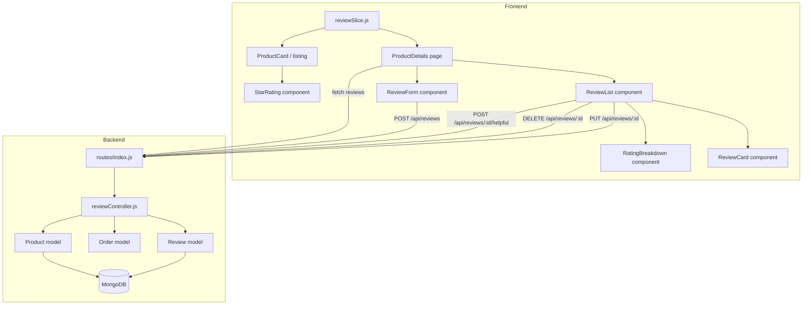
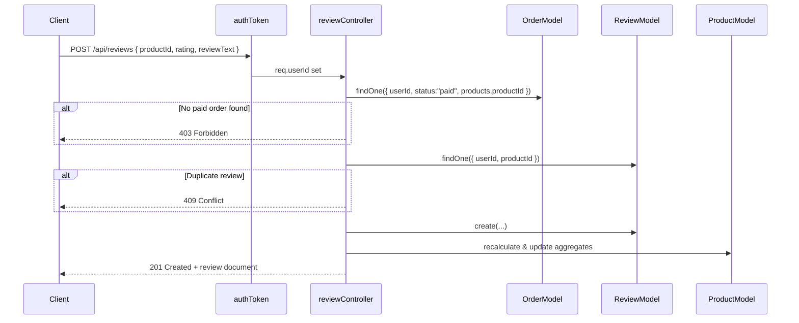

# Design Document: Product Reviews & Ratings

## Overview

This document describes the technical design for adding a Product Reviews & Ratings system to the existing MERN stack e-commerce application. The feature allows verified buyers (users with a paid order containing the product) to submit star ratings and written reviews, with aggregate rating data surfaced on both product listing and detail pages.

### Key Design Goals

1. **Verified-purchase gating**: Only users with a `status: "paid"` order containing the product may submit reviews — enforced server-side.
2. **Data integrity**: One review per user per product, enforced via a unique compound index.
3. **Aggregate consistency**: `averageRating`, `reviewCount`, and `ratingBreakdown` on the Product document are updated atomically whenever a review is created, edited, or deleted.
4. **Helpful votes embedded**: `helpfulVotes` count and `helpfulVotedBy` array live directly on the Review document — no separate collection needed.
5. **Consistent patterns**: Follows existing controller/route/SummaryApi/Redux slice conventions already established in the codebase.

### Technology Stack

- **Backend**: Node.js, Express, Mongoose (MongoDB)
- **Frontend**: React, Redux Toolkit, Tailwind CSS
- **Auth**: Existing `authToken` middleware (sets `req.userId`)
- **Property-based testing**: `fast-check` (JavaScript)

---

## Architecture

### High-Level Flow



### Data Flow: Review Creation



---

## Components and Interfaces

### Backend: `reviewController.js`

| Function | Method | Route | Auth | Description |
|---|---|---|---|---|
| `createReview` | POST | `/api/reviews` | required | Create a new review (verified-purchase check) |
| `getProductReviews` | GET | `/api/reviews/:productId` | optional | Paginated, sorted review list + aggregates |
| `updateReview` | PUT | `/api/reviews/:reviewId` | required | Owner-only edit |
| `deleteReview` | DELETE | `/api/reviews/:reviewId` | required | Owner or admin delete |
| `toggleHelpfulVote` | POST | `/api/reviews/:reviewId/helpful` | required | Add or remove helpful vote |

### Frontend Components

| Component | Props | Responsibility |
|---|---|---|
| `StarRating` | `rating`, `count?`, `size?`, `interactive?`, `onChange?` | Render filled/half/empty stars; optionally interactive for input |
| `RatingBreakdown` | `averageRating`, `reviewCount`, `ratingBreakdown` | Bar chart of star distribution |
| `ReviewForm` | `productId`, `existingReview?`, `onSuccess` | Create / edit form with star picker and textarea |
| `ReviewCard` | `review`, `currentUserId`, `onEdit`, `onDelete`, `onHelpful` | Single review display with helpful vote button |
| `ReviewList` | `productId` | Fetches and renders paginated, sortable list + form |

### Redux: `reviewSlice.js`

State shape:
```js
{
  reviews: [],          // current page of reviews
  aggregates: {         // averageRating, reviewCount, ratingBreakdown
    averageRating: 0,
    reviewCount: 0,
    ratingBreakdown: { 1: 0, 2: 0, 3: 0, 4: 0, 5: 0 }
  },
  pagination: { page: 1, totalPages: 1, pageSize: 10 },
  sort: 'createdAt',    // 'createdAt' | 'helpfulVotes'
  loading: false,
  error: null,
  submitting: false
}
```

Async thunks: `fetchProductReviews`, `submitReview`, `editReview`, `removeReview`, `voteHelpful`

### API Entries (`frontend/src/common/index.js` additions)

```js
getProductReviews:    { url: `${backenddomain}/api/reviews/:productId`, method: 'GET' },
createReview:         { url: `${backenddomain}/api/reviews`,            method: 'POST' },
updateReview:         { url: `${backenddomain}/api/reviews/:reviewId`,  method: 'PUT' },
deleteReview:         { url: `${backenddomain}/api/reviews/:reviewId`,  method: 'DELETE' },
toggleHelpfulVote:    { url: `${backenddomain}/api/reviews/:reviewId/helpful`, method: 'POST' },
```

---

## Data Models

### Review Model (`Backend/models/reviewModel.js`)

```js
const reviewSchema = new mongoose.Schema({
  userId: {
    type: mongoose.Schema.Types.ObjectId,
    ref: 'user',
    required: true,
    index: true
  },
  productId: {
    type: mongoose.Schema.Types.ObjectId,
    ref: 'Product',
    required: true,
    index: true
  },
  rating: {
    type: Number,
    required: true,
    min: [1, 'Rating must be at least 1'],
    max: [5, 'Rating must be at most 5'],
    validate: { validator: Number.isInteger, message: 'Rating must be an integer' }
  },
  reviewText: {
    type: String,
    default: '',
    maxlength: [2000, 'Review text cannot exceed 2000 characters'],
    trim: true
  },
  helpfulVotes: {
    type: Number,
    default: 0,
    min: 0
  },
  helpfulVotedBy: [{
    type: mongoose.Schema.Types.ObjectId,
    ref: 'user'
  }]
}, { timestamps: true });

// Enforce one review per user per product
reviewSchema.index({ userId: 1, productId: 1 }, { unique: true });
```

### Product Model additions

The existing `productModel.js` gains three fields:

```js
averageRating:   { type: Number, default: 0, min: 0, max: 5 },
reviewCount:     { type: Number, default: 0, min: 0 },
ratingBreakdown: {
  1: { type: Number, default: 0 },
  2: { type: Number, default: 0 },
  3: { type: Number, default: 0 },
  4: { type: Number, default: 0 },
  5: { type: Number, default: 0 }
}
```

### Rating Aggregation Helper

A shared helper `recalculateAggregates(productId)` is called after every create/edit/delete:

```js
async function recalculateAggregates(productId) {
  const result = await Review.aggregate([
    { $match: { productId: new mongoose.Types.ObjectId(productId) } },
    {
      $group: {
        _id: '$productId',
        averageRating: { $avg: '$rating' },
        reviewCount:   { $sum: 1 },
        breakdown:     { $push: '$rating' }
      }
    }
  ]);

  if (result.length === 0) {
    await Product.findByIdAndUpdate(productId, {
      averageRating: 0, reviewCount: 0,
      'ratingBreakdown.1': 0, 'ratingBreakdown.2': 0,
      'ratingBreakdown.3': 0, 'ratingBreakdown.4': 0, 'ratingBreakdown.5': 0
    });
    return;
  }

  const { averageRating, reviewCount, breakdown } = result[0];
  const counts = { 1: 0, 2: 0, 3: 0, 4: 0, 5: 0 };
  breakdown.forEach(r => counts[r]++);

  await Product.findByIdAndUpdate(productId, {
    averageRating: Math.round(averageRating * 10) / 10,
    reviewCount,
    'ratingBreakdown.1': counts[1],
    'ratingBreakdown.2': counts[2],
    'ratingBreakdown.3': counts[3],
    'ratingBreakdown.4': counts[4],
    'ratingBreakdown.5': counts[5]
  });
}
```

---

## Correctness Properties

*A property is a characteristic or behavior that should hold true across all valid executions of a system — essentially, a formal statement about what the system should do. Properties serve as the bridge between human-readable specifications and machine-verifiable correctness guarantees.*

### Property 1: Verified Purchase Enforcement

*For any* user and product, the review creation endpoint SHALL grant access if and only if at least one Order exists with that userId, `status: "paid"`, and that productId in its products array. Users without a qualifying paid order SHALL always receive HTTP 403.

**Validates: Requirements 1.1, 1.2**

---

### Property 2: One Review Per User Per Product

*For any* userId and productId, after a review has been successfully created, any subsequent create attempt with the same userId and productId SHALL be rejected with HTTP 409, and the total review count for that product SHALL remain unchanged.

**Validates: Requirements 2.1, 2.2**

---

### Property 3: Review Input Validation

*For any* rating value in the integer range [1, 5] and any reviewText of length ≤ 2000 characters, the create/update request SHALL succeed. *For any* rating outside [1, 5] or any reviewText exceeding 2000 characters, the request SHALL be rejected with HTTP 400.

**Validates: Requirements 3.1, 3.2, 3.3**

---

### Property 4: Review Ownership Enforcement

*For any* review owned by user A, an edit or delete request from any user B where B ≠ A and B is not an admin SHALL be rejected with HTTP 403. After a successful owner-delete, fetching that review by ID SHALL return HTTP 404.

**Validates: Requirements 4.1, 4.2, 4.4**

---

### Property 5: Admin Authorization

*For any* review, a delete request from a user with `role: "ADMIN"` SHALL succeed regardless of review ownership. A delete request from any user without `role: "ADMIN"` on the admin-delete endpoint SHALL be rejected with HTTP 403.

**Validates: Requirements 5.1, 5.2**

---

### Property 6: Rating Aggregation Invariant

*For any* set of reviews for a product, the following invariants SHALL hold simultaneously after any create, edit, or delete operation:
- `averageRating` equals the arithmetic mean of all current `rating` values, rounded to one decimal place (or 0 if no reviews)
- `reviewCount` equals the total number of reviews for that product
- The sum of `ratingBreakdown[1..5]` equals `reviewCount`

**Validates: Requirements 6.1, 6.2, 6.3, 6.5**

---

### Property 7: Pagination and Sorting Correctness

*For any* page size `p` and page number `n`, the reviews endpoint SHALL return at most `p` reviews. When sorted by `createdAt` descending, each review in the result SHALL have `createdAt ≥` the next review's `createdAt`. When sorted by `helpfulVotes` descending, each review SHALL have `helpfulVotes ≥` the next review's `helpfulVotes`.

**Validates: Requirements 7.2, 7.3, 7.4**

---

### Property 8: Helpful Vote Round-Trip Invariant

*For any* authenticated user and any review, after casting a helpful vote: the user's ID SHALL appear in `helpfulVotedBy` and `helpfulVotes` SHALL equal `helpfulVotedBy.length`. After subsequently removing that vote: the user's ID SHALL no longer appear in `helpfulVotedBy` and `helpfulVotes` SHALL be restored to its pre-vote value.

**Validates: Requirements 9.1, 9.3, 9.4**

---

### Property 9: Duplicate Vote Rejection

*For any* authenticated user and any review, submitting a helpful vote when that user's ID is already in `helpfulVotedBy` SHALL be rejected with HTTP 409, and `helpfulVotes` SHALL remain unchanged.

**Validates: Requirement 9.2**

---

### Property 10: Review Serialization Round-Trip

*For any* valid Review document, serializing it to JSON and deserializing it SHALL produce an object with identical values for `_id`, `userId`, `productId`, `rating`, `reviewText`, `createdAt`, `updatedAt`, and `helpfulVotes`. Every review returned by the API SHALL include all of these fields in the response body.

**Validates: Requirements 10.1, 10.2**

---

## Error Handling

| Scenario | HTTP Status | Response Shape |
|---|---|---|
| Not authenticated | 401 | `{ success: false, message: "User Not login" }` |
| Not a verified buyer | 403 | `{ success: false, message: "You must purchase this product before reviewing" }` |
| Not review owner (edit/delete) | 403 | `{ success: false, message: "You are not authorized to modify this review" }` |
| Not admin (admin delete) | 403 | `{ success: false, message: "Admin access required" }` |
| Duplicate review | 409 | `{ success: false, message: "You have already reviewed this product" }` |
| Duplicate helpful vote | 409 | `{ success: false, message: "You have already voted this review as helpful" }` |
| Review not found | 404 | `{ success: false, message: "Review not found" }` |
| Validation failure | 400 | `{ success: false, message: "<field>: <reason>" }` |
| Success (create) | 201 | `{ success: true, data: <review> }` |
| Success (other) | 200 | `{ success: true, data: <review or message> }` |

All controllers follow the existing pattern of `try/catch` with `res.status(N).json({ success, message, data })`.

---

## Testing Strategy

### Dual Testing Approach

Both unit/example-based tests and property-based tests are used together for comprehensive coverage.

**Unit tests** cover:
- Specific happy-path examples (create, edit, delete, vote)
- Integration points (route → controller → model)
- Edge cases: zero reviews, non-existent IDs, unauthenticated requests

**Property-based tests** cover the 10 correctness properties above, using `fast-check` to generate random inputs and verify universal invariants.

### Property-Based Testing with `fast-check`

Install: `npm install --save-dev fast-check` in the Backend directory.

Each property test runs a minimum of **100 iterations**. Each test is tagged with a comment referencing the design property:

```js
// Feature: product-reviews-ratings, Property 6: Rating Aggregation Invariant
it('aggregation invariant holds for any set of ratings', () => {
  fc.assert(fc.property(
    fc.array(fc.integer({ min: 1, max: 5 }), { minLength: 1, maxLength: 50 }),
    (ratings) => {
      const expected = Math.round((ratings.reduce((a, b) => a + b, 0) / ratings.length) * 10) / 10;
      const breakdown = { 1: 0, 2: 0, 3: 0, 4: 0, 5: 0 };
      ratings.forEach(r => breakdown[r]++);
      const sumBreakdown = Object.values(breakdown).reduce((a, b) => a + b, 0);
      // averageRating matches arithmetic mean rounded to 1dp
      expect(computeAverage(ratings)).toBe(expected);
      // breakdown sums to reviewCount
      expect(sumBreakdown).toBe(ratings.length);
    }
  ), { numRuns: 100 });
});
```

Tag format for all property tests: `// Feature: product-reviews-ratings, Property N: <property_text>`

### Test File Structure

```
Backend/
  __tests__/
    review.unit.test.js       # example-based unit tests
    review.property.test.js   # fast-check property tests (Properties 1-10)
    review.integration.test.js # route-level integration tests

frontend/src/
  components/reviews/
    __tests__/
      StarRating.test.js
      ReviewForm.test.js
      ReviewCard.test.js
      ReviewList.test.js
```

### Integration Tests

Route-level tests use `supertest` + an in-memory MongoDB (`mongodb-memory-server`) to verify:
- Full create → aggregate update flow
- Pagination returns correct page slices
- Admin delete bypasses ownership check
- Unauthenticated requests are rejected
