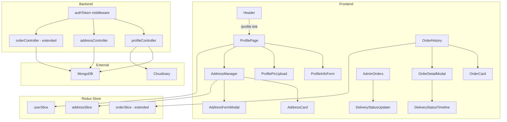

# Design Document: User Profile & Address Management

## Overview

This feature extends the existing MERN e-commerce application with three interconnected capabilities:

1. **Profile Management** — authenticated users can view and edit their name, phone number, and profile picture (uploaded to Cloudinary).
2. **Address Management** — users can save up to 5 shipping addresses, edit/delete them, and designate one as the default.
3. **Enhanced Order History** — the existing `/orders` page gains pagination, skeleton loading, and a per-order detail view with a delivery status timeline. Admins can update delivery status.

The design follows the existing project conventions: Express controllers in `Backend/controller/`, Mongoose models in `Backend/models/`, routes registered in `Backend/routes/index.js`, Redux slices in `frontend/src/store/`, pages in `frontend/src/pages/`, and API entries in `frontend/src/common/index.js`.

---

## Architecture



The backend is stateless; all authentication is handled by the existing `authToken` JWT middleware. Addresses are embedded in the user document (see Data Models). The frontend communicates exclusively through the `SummaryApi` registry in `frontend/src/common/index.js`.

---

## Components and Interfaces

### Backend Controllers

#### `Backend/controller/user/profileController.js`
| Function | Method | Route | Auth |
|---|---|---|---|
| `getProfile` | GET | `/api/profile` | `authToken` |
| `updateProfile` | PUT | `/api/profile` | `authToken` |
| `uploadProfilePic` | POST | `/api/profile/upload-pic` | `authToken` |

**`getProfile(req, res)`**
- Reads `req.userId` (set by `authToken`).
- Returns `{ name, email, phone, profilePic, role }` — never returns `password`.

**`updateProfile(req, res)`**
- Accepts `{ name?, phone? }` in request body.
- Validates: `name` 2–50 chars; `phone` matches `/^\+?[0-9]{10,15}$/` when provided.
- Returns 400 with a descriptive message on validation failure.
- Returns updated user object on success.

**`uploadProfilePic(req, res)`**
- Accepts `multipart/form-data` with field `profilePic`.
- Uses `multer` (memory storage) to buffer the file.
- Validates MIME type (`image/jpeg`, `image/png`, `image/webp`) and size ≤ 2 MB.
- Uploads to Cloudinary via `cloudinary.uploader.upload_stream`.
- On success: updates `user.profilePic` in MongoDB, returns new URL.
- On Cloudinary failure: returns 500, does **not** update MongoDB.

#### `Backend/controller/user/addressController.js`
| Function | Method | Route | Auth |
|---|---|---|---|
| `getAddresses` | GET | `/api/addresses` | `authToken` |
| `addAddress` | POST | `/api/addresses` | `authToken` |
| `updateAddress` | PUT | `/api/addresses/:addressId` | `authToken` |
| `deleteAddress` | DELETE | `/api/addresses/:addressId` | `authToken` |
| `setDefaultAddress` | PUT | `/api/addresses/:addressId/default` | `authToken` |

**Address validation rules (shared)**
- `fullName`, `addressLine1`, `city`, `state`, `country`: non-empty strings.
- `postalCode`: matches `/^[A-Za-z0-9\-]{3,10}$/`.
- `phone`: matches `/^\+?[0-9]{10,15}$/`.
- `addressLine2`: optional string.

**`addAddress`** — enforces max 5 addresses; returns 400 if limit reached.

**`updateAddress` / `deleteAddress`** — verifies the address `_id` exists in `req.user.addresses` (ownership check); returns 403 if not found.

**`setDefaultAddress`** — sets `isDefault: true` on the target address and `isDefault: false` on all others atomically using `$set` with positional operators.

**`deleteAddress`** — if the deleted address was the default and it was the last address, clears the default designation (no-op since the array is now empty).

#### `Backend/controller/order/orderController.js` (extended)
| Function | Method | Route | Auth |
|---|---|---|---|
| `getUserOrders` | GET | `/api/orders/user?page=&limit=` | `authToken` |
| `getOrderById` | GET | `/api/orders/:orderId` | `authToken` |
| `updateDeliveryStatus` | PUT | `/api/orders/:orderId/delivery-status` | `authToken` + admin check |

**`getUserOrders`** — adds `page` (default 1) and `limit` (default 10, max 10) query params; returns `{ data, total, page, totalPages }`.

**`updateDeliveryStatus`** — accepts `{ deliveryStatus }` in body; validates against enum; records `deliveryStatusUpdatedAt`; returns 403 for non-admins.

---

### Frontend Components

#### Pages
| Page | Route | Description |
|---|---|---|
| `ProfilePage` | `/profile` | Profile info + address manager |
| `OrderHistory` | `/orders` | Paginated order cards (existing, enhanced) |
| `OrderDetailPage` | `/orders/:orderId` | Full order detail with status timeline |

#### New Components
| Component | Location | Description |
|---|---|---|
| `ProfileInfoForm` | `components/profile/` | Controlled form for name + phone |
| `ProfilePicUpload` | `components/profile/` | Avatar display + file input |
| `AddressManager` | `components/profile/` | List of AddressCards + add button |
| `AddressCard` | `components/profile/` | Single address display with edit/delete/default controls |
| `AddressFormModal` | `components/profile/` | Modal form for add/edit address |
| `OrderCard` | `components/orders/` | Enhanced order summary card |
| `DeliveryStatusTimeline` | `components/orders/` | Visual step-by-step status tracker |
| `SkeletonCard` | `components/common/` | Reusable skeleton loader |

#### Redux Slices
| Slice | File | State |
|---|---|---|
| `addressSlice` | `store/addressSlice.js` | `{ addresses, loading, error }` |
| `orderSlice` (extended) | `store/orderSlice.js` | adds `selectedOrder`, `pagination` |

The existing `userSlice` is extended to include `phone` in the stored user object (no structural change needed — the slice stores whatever the API returns).

---

## Data Models

### User Model (extended)

```javascript
// Backend/models/userModel.js
const addressSchema = new mongoose.Schema({
  fullName:     { type: String, required: true, trim: true },
  phone:        { type: String, required: true },
  addressLine1: { type: String, required: true, trim: true },
  addressLine2: { type: String, default: '' },
  city:         { type: String, required: true, trim: true },
  state:        { type: String, required: true, trim: true },
  postalCode:   { type: String, required: true, match: /^[A-Za-z0-9\-]{3,10}$/ },
  country:      { type: String, required: true, trim: true },
  isDefault:    { type: Boolean, default: false },
}, { timestamps: true });

const userSchema = new mongoose.Schema({
  name:       String,
  email:      { type: String, unique: true, required: true },
  password:   String,
  profilePic: String,
  role:       String,
  phone:      { type: String, default: '' },
  addresses:  { type: [addressSchema], default: [], validate: [v => v.length <= 5, 'Maximum 5 addresses allowed'] },
}, { timestamps: true });
```

**Design decision — embedded vs. separate collection**: Addresses are embedded in the user document. Rationale:
- A user has at most 5 addresses; the subdocument array stays small.
- All address reads happen alongside user reads (profile page, checkout pre-fill), so embedding avoids an extra round-trip.
- Atomic updates (e.g., flipping `isDefault`) are simpler with `$set` on a subdocument than with a separate collection.
- The `addressSchema` uses Mongoose's built-in `_id` generation, satisfying the unique-identifier requirement.

### Order Model (extended)

```javascript
// Backend/models/orderModel.js — additions
deliveryStatus: {
  type: String,
  enum: ['processing', 'shipped', 'out_for_delivery', 'delivered', 'cancelled'],
  default: 'processing',
  index: true
},
deliveryStatusUpdatedAt: {
  type: Date,
  default: Date.now
},
shippingAddress: {           // snapshot of address at time of purchase
  fullName:     String,
  addressLine1: String,
  addressLine2: String,
  city:         String,
  state:        String,
  postalCode:   String,
  country:      String,
  phone:        String,
}
```

**Design decision — address snapshot**: The `shippingAddress` field on the order stores a copy of the address used at checkout time. This ensures the order detail view always shows the correct address even if the user later edits or deletes that saved address.

---

## Correctness Properties

*A property is a characteristic or behavior that should hold true across all valid executions of a system — essentially, a formal statement about what the system should do. Properties serve as the bridge between human-readable specifications and machine-verifiable correctness guarantees.*

### Property 1: Profile update round-trip

*For any* authenticated user and any valid `{ name, phone }` payload, submitting a profile update and then fetching the profile SHALL return a user object whose `name` and `phone` fields equal the submitted values.

**Validates: Requirements 2.1**

---

### Property 2: Name validation rejects out-of-range lengths

*For any* name string whose length is less than 2 or greater than 50 characters, the profile update endpoint SHALL return a 400 response and the user's stored name SHALL remain unchanged.

**Validates: Requirements 2.2, 2.4**

---

### Property 3: Phone validation rejects non-conforming strings

*For any* phone string that does not match the 10–15 digit international format (with optional leading `+`), the profile update endpoint SHALL return a 400 response and the user's stored phone SHALL remain unchanged.

**Validates: Requirements 2.3, 2.5**

---

### Property 4: Address limit enforcement

*For any* user who already has 5 saved addresses, attempting to add a 6th address SHALL return a 400 response and the user's address count SHALL remain 5.

**Validates: Requirements 4.2, 4.3**

---

### Property 5: Address ownership isolation

*For any* two distinct authenticated users A and B, user A SHALL NOT be able to edit or delete an address that belongs to user B — the service SHALL return 403.

**Validates: Requirements 5.3, 11.4**

---

### Property 6: Default address mutual exclusivity

*For any* user with one or more saved addresses, after calling `setDefaultAddress` for any address in the list, exactly one address SHALL have `isDefault: true` and all others SHALL have `isDefault: false`.

**Validates: Requirements 6.1, 6.2**

---

### Property 7: Default address cleared on last-address deletion

*For any* user whose only saved address is also the default address, deleting that address SHALL result in the user having zero addresses and no default address designation.

**Validates: Requirements 5.4**

---

### Property 8: Postal code validation rejects non-conforming values

*For any* postal code string that contains characters outside `[A-Za-z0-9\-]` or whose length is outside the range 3–10, the address creation or update endpoint SHALL return a 400 response and the address record SHALL NOT be created or modified.

**Validates: Requirements 4.5, 7.4**

---

### Property 9: Delivery status transition preserves timestamp

*For any* order and any valid `deliveryStatus` value, after an admin updates the delivery status, the order's `deliveryStatusUpdatedAt` field SHALL be a timestamp that is greater than or equal to the timestamp recorded before the update.

**Validates: Requirements 10.1, 10.2**

---

### Property 10: Non-admin delivery status update is rejected

*For any* order and any authenticated non-admin user, attempting to update `deliveryStatus` SHALL return a 403 response and the order's `deliveryStatus` SHALL remain unchanged.

**Validates: Requirements 10.6**

---

### Property 11: Order pagination consistency

*For any* user with N orders (N > 0), fetching all pages with `limit=10` and collecting all returned orders SHALL yield exactly N unique orders with no duplicates and no omissions.

**Validates: Requirements 8.5**

---

## Error Handling

| Scenario | HTTP Status | Response shape |
|---|---|---|
| Missing or invalid JWT | 401 | `{ success: false, error: true, message: "..." }` |
| Accessing another user's address | 403 | `{ success: false, error: true, message: "..." }` |
| Non-admin updating delivery status | 403 | `{ success: false, error: true, message: "..." }` |
| Validation failure (name, phone, postal code, etc.) | 400 | `{ success: false, error: true, message: "<field>: <reason>" }` |
| Address limit exceeded | 400 | `{ success: false, error: true, message: "Maximum 5 addresses allowed" }` |
| Unsupported image format or size > 2 MB | 400 | `{ success: false, error: true, message: "..." }` |
| Cloudinary upload failure | 500 | `{ success: false, error: true, message: "Image upload failed" }` |
| Order not found or not owned | 404 | `{ success: false, error: true, message: "Order not found" }` |
| Generic server error | 500 | `{ success: false, error: true, message: "Internal server error" }` |

**Frontend error handling**:
- All API calls are wrapped in try/catch; errors are dispatched to the relevant Redux slice's `error` field.
- `toast.error(message)` is shown for user-facing errors (consistent with existing pattern).
- The Profile Page shows an inline retry button if the initial profile load fails (Requirement 1.3).
- Unauthenticated access to `/profile` or `/orders/:orderId` redirects to `/login` via a `ProtectedRoute` wrapper (consistent with the existing pattern used for admin routes).

---

## Testing Strategy

### Unit Tests (Jest + React Testing Library on frontend; Jest + Supertest on backend)

Focus areas:
- **Validation logic**: name length bounds, phone regex, postal code regex — test boundary values (length 1, 2, 50, 51; valid/invalid phone formats).
- **Address controller**: add/edit/delete/setDefault with mocked Mongoose models.
- **Profile controller**: `updateProfile` and `uploadProfilePic` with mocked Cloudinary and Mongoose.
- **Order controller extensions**: `getUserOrders` pagination math, `updateDeliveryStatus` admin guard.
- **Frontend components**: `AddressFormModal` renders correct fields; `DeliveryStatusTimeline` renders correct active step; `ProfileInfoForm` shows validation errors.

### Property-Based Tests (fast-check — already available in the JS ecosystem)

Each property test runs a minimum of **100 iterations**.

Tag format: `// Feature: user-profile-address-management, Property N: <property_text>`

| Property | Generator inputs | Assertion |
|---|---|---|
| P1 — Profile round-trip | Random valid `{ name (2–50 chars), phone (10–15 digits) }` | Fetched profile matches submitted values |
| P2 — Name length rejection | Strings with length < 2 or > 50 | Response status 400; stored name unchanged |
| P3 — Phone format rejection | Strings not matching `/^\+?[0-9]{10,15}$/` | Response status 400; stored phone unchanged |
| P4 — Address limit | User with 5 addresses + random valid 6th address | Response status 400; address count stays 5 |
| P5 — Address ownership | Two users, random address belonging to user A | User B's request returns 403 |
| P6 — Default mutual exclusivity | User with 1–5 addresses, random target address index | Exactly one `isDefault: true` after `setDefault` |
| P7 — Last default deleted | User with exactly 1 default address | Zero addresses, no default after delete |
| P8 — Postal code rejection | Strings with invalid chars or length outside 3–10 | Response status 400; address unchanged |
| P9 — Delivery status timestamp | Random valid `deliveryStatus` value, admin user | `deliveryStatusUpdatedAt` ≥ pre-update timestamp |
| P10 — Non-admin status rejection | Random non-admin user, random valid status | Response status 403; status unchanged |
| P11 — Pagination consistency | N orders (1–50), random page/limit combos | All pages together yield exactly N unique orders |

### Integration Tests

- End-to-end profile update flow (real MongoDB in-memory via `mongodb-memory-server`).
- Cloudinary upload mocked at the HTTP level using `nock`.
- Order pagination with real data set.

### Smoke Tests

- `GET /api/profile` returns 401 without a token.
- `POST /api/addresses` returns 401 without a token.
- `PUT /api/orders/:id/delivery-status` returns 403 for a regular user.
