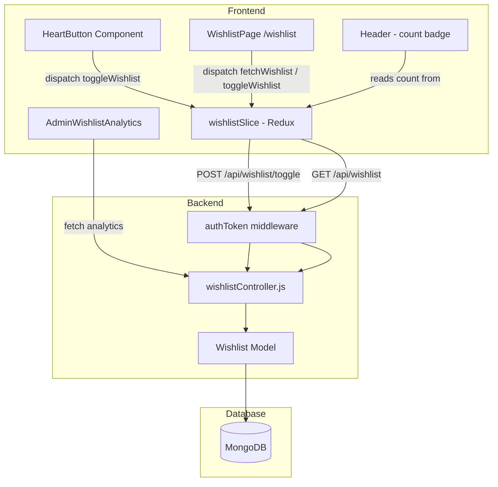

# Design Document: Wishlist / Save for Later

## Overview

This feature adds a persistent, per-user wishlist to the existing MERN e-commerce application. Users can toggle products into/out of their wishlist via a heart icon on product cards and the product detail page. Wishlist state is managed in a Redux Toolkit slice and persisted in MongoDB. The header displays a live count badge. A dedicated `/wishlist` page lets users review saved products, add them to cart, or remove them. Admins get an analytics view of the top 20 most-wishlisted products.

The design follows the same patterns already established in the codebase:
- Backend: Express controller + `authToken` middleware + Mongoose model, registered in `Backend/routes/index.js`
- Frontend: Redux Toolkit slice in `frontend/src/store/`, API entries in `frontend/src/common/index.js`, React components with Tailwind CSS and `react-icons`

---

## Architecture



**Data flow for toggle:**
1. User clicks HeartButton → optimistic Redux state update
2. `toggleWishlist` thunk fires `POST /api/wishlist/toggle`
3. `authToken` middleware validates cookie, sets `req.userId`
4. `wishlistController.toggleWishlist` upserts or deletes the Wishlist document
5. Response confirms action; on error the optimistic update is rolled back

**Initialization:**
- `App.js` dispatches `fetchWishlist` on mount (alongside existing `fetchUserDetails` / `fetchUserAddToCart`), populating `wishlistSlice.items` with an array of productId strings

---

## Components and Interfaces

### Backend

#### `Backend/models/wishlistModel.js`
Mongoose model for wishlist entries.

#### `Backend/controller/wishlist/wishlistController.js`
Three exported functions:
- `toggleWishlist(req, res)` — add or remove entry for `req.userId` + `req.body.productId`
- `getUserWishlist(req, res)` — return all productIds for `req.userId`
- `getWishlistAnalytics(req, res)` — admin-only aggregation of top 20 products by wishlist count

#### Routes (added to `Backend/routes/index.js`)
```
POST   /api/wishlist/toggle        authToken  → toggleWishlist
GET    /api/wishlist               authToken  → getUserWishlist
GET    /api/wishlist/analytics     authToken  → getWishlistAnalytics
```

### Frontend

#### `frontend/src/store/wishlistSlice.js`
Redux Toolkit slice with async thunks:
- `fetchWishlist` — GET `/api/wishlist`, populates `items`
- `toggleWishlist` — POST `/api/wishlist/toggle`, optimistic update

State shape:
```js
{
  items: [],      // array of productId strings
  loading: false,
  error: null
}
```
Derived selector: `selectWishlistCount` = `items.length`

#### `frontend/src/components/HeartButton.js`
Props: `{ productId }`. Reads Redux state to determine filled/unfilled. Dispatches `toggleWishlist`. Redirects to `/login` if user is not authenticated.

#### `frontend/src/pages/WishlistPage.js`
Route: `/wishlist`. Fetches full product details for each productId in the slice. Renders product cards with "Add to Cart" and "Remove" actions. Shows empty state when `items` is empty.

#### `frontend/src/pages/AdminWishlistAnalytics.js`
Admin panel child route. Fetches `GET /api/wishlist/analytics` and renders a table of top 20 products.

#### Modified files
| File | Change |
|---|---|
| `frontend/src/components/Header.js` | Add wishlist icon + count badge (mirrors cart badge pattern) |
| `frontend/src/components/VerticalCard.js` | Render `<HeartButton productId={product._id} />` on each card |
| `frontend/src/pages/ProductDetails.js` | Render `<HeartButton productId={productId} />` near the add-to-cart button |
| `frontend/src/App.js` | Dispatch `fetchWishlist` on mount |
| `frontend/src/store/store.js` | Register `wishlistReducer` |
| `frontend/src/common/index.js` | Add `toggleWishlist`, `getUserWishlist`, `getWishlistAnalytics` entries |
| `frontend/src/routes/index.js` | Add `/wishlist` and `admin-panel/wishlist-analytics` routes |
| `frontend/src/pages/Adminpanel.js` | Add "Wishlist Analytics" nav link |

---

## Data Models

### Wishlist (MongoDB)

```js
// Backend/models/wishlistModel.js
const wishlistSchema = new mongoose.Schema(
  {
    userId:    { type: mongoose.Schema.Types.ObjectId, ref: 'user', required: true },
    productId: { type: mongoose.Schema.Types.ObjectId, ref: 'Product', required: true },
  },
  { timestamps: true }   // provides createdAt, updatedAt
);

// Enforce uniqueness: one entry per (user, product) pair
wishlistSchema.index({ userId: 1, productId: 1 }, { unique: true });

const Wishlist = mongoose.model('Wishlist', wishlistSchema);
```

The compound unique index satisfies Requirement 1.3 at the database level and enables efficient `findOne` lookups during toggle.

### Redux State

```ts
interface WishlistState {
  items: string[];   // productId strings
  loading: boolean;
  error: string | null;
}
```

### API Response Shapes

**GET /api/wishlist**
```json
{ "success": true, "data": ["productId1", "productId2"] }
```

**POST /api/wishlist/toggle**
```json
{ "success": true, "data": { "action": "added" | "removed", "productId": "..." } }
```

**GET /api/wishlist/analytics**
```json
{
  "success": true,
  "data": [
    { "productId": "...", "productName": "...", "productImage": [...], "category": "...", "count": 42 }
  ]
}
```

---

## Correctness Properties

*A property is a characteristic or behavior that should hold true across all valid executions of a system — essentially, a formal statement about what the system should do. Properties serve as the bridge between human-readable specifications and machine-verifiable correctness guarantees.*

### Property 1: Toggle add inserts the product

*For any* authenticated user and any product not currently in that user's wishlist, calling `toggleWishlist` SHALL result in the product being present in the user's wishlist.

**Validates: Requirements 1.1**

---

### Property 2: Toggle round-trip returns to original state

*For any* authenticated user and any product, calling `toggleWishlist` twice in succession SHALL leave the wishlist in the same state as before either call (add then remove = no net change).

**Validates: Requirements 1.2**

---

### Property 3: Wishlist uniqueness invariant

*For any* authenticated user and any product, regardless of how many times `toggleWishlist` is called in the "add" direction, the wishlist SHALL contain at most one entry for that (userId, productId) pair.

**Validates: Requirements 1.3**

---

### Property 4: Wishlist document schema invariant

*For any* wishlist entry stored in MongoDB, the document SHALL contain non-null `userId`, `productId`, and `createdAt` fields.

**Validates: Requirements 2.1**

---

### Property 5: Heart icon state reflects Redux membership

*For any* set of productIds in the Redux wishlist store, a `HeartButton` rendered for a productId that IS in the set SHALL display as filled, and one rendered for a productId that is NOT in the set SHALL display as unfilled.

**Validates: Requirements 2.3, 3.1, 3.2**

---

### Property 6: Header count badge reflects wishlist size

*For any* wishlist `items` array in Redux state, the count badge rendered in the Header SHALL display a number equal to `items.length`.

**Validates: Requirements 4.1, 4.2**

---

### Property 7: Wishlist page renders all required product fields

*For any* non-empty array of wishlist products, the WishlistPage SHALL render a card for each product that includes the product image, name, category, selling price, and original price.

**Validates: Requirements 5.1**

---

### Property 8: Wishlist page removal updates displayed list

*For any* wishlist with N items, removing one item SHALL result in the WishlistPage displaying exactly N-1 cards, with the removed product's card absent.

**Validates: Requirements 7.2**

---

### Property 9: Analytics results are sorted descending and bounded

*For any* wishlist dataset, the analytics endpoint SHALL return at most 20 results ordered by wishlist count in descending order (i.e., `results[i].count >= results[i+1].count` for all valid i).

**Validates: Requirements 8.1**

---

### Property 10: Non-admin users receive 403 from analytics endpoint

*For any* request to `GET /api/wishlist/analytics` made by a user whose role is not `ADMIN` or `SUPERADMIN`, the response SHALL have HTTP status 403.

**Validates: Requirements 8.4**

---

## Error Handling

| Scenario | Backend response | Frontend behavior |
|---|---|---|
| Unauthenticated toggle request | `authToken` returns 200 `{ error: true, message: "User Not login" }` | HeartButton redirects to `/login` before calling API |
| Product not found during toggle | 404 `{ success: false, message: "Product not found" }` | Toast error, optimistic update rolled back |
| Duplicate insert (race condition) | MongoDB unique index error caught, treated as "already added" — return `{ action: "added" }` | No visible error; state already correct |
| Non-admin calls analytics | 403 `{ success: false, message: "Access denied" }` | Admin page shows error message |
| Network failure on toggle | Fetch throws | Optimistic update rolled back, toast error shown |
| Empty wishlist fetch | 200 `{ success: true, data: [] }` | WishlistPage shows empty-state UI |

---

## Testing Strategy

### Unit Tests (example-based)

- `HeartButton` renders filled when productId is in Redux state
- `HeartButton` renders unfilled when productId is absent from Redux state
- `HeartButton` redirects to `/login` when user is unauthenticated
- `WishlistPage` shows empty-state message when `items` is `[]`
- `WishlistPage` redirects to `/login` when user is unauthenticated
- `Header` does not render wishlist badge when user is not authenticated
- `wishlistController.toggleWishlist` returns 403 when `req.userId` is missing
- `wishlistController.getWishlistAnalytics` returns 403 for non-admin role

### Property-Based Tests

Property-based tests use **fast-check** (already available in the JS ecosystem; install with `npm install --save-dev fast-check`). Each test runs a minimum of **100 iterations**.

Tag format: `// Feature: wishlist, Property N: <property text>`

| Property | Test description |
|---|---|
| Property 1 | For any userId + productId not in wishlist, toggle adds it |
| Property 2 | For any userId + productId, double-toggle returns to original state |
| Property 3 | For any userId + productId, repeated add-direction toggles yield count ≤ 1 |
| Property 4 | For any saved wishlist entry, document has userId, productId, createdAt |
| Property 5 | For any productId set in Redux, HeartButton fill state matches membership |
| Property 6 | For any items array, Header badge count equals items.length |
| Property 7 | For any product array, WishlistPage renders all required fields per card |
| Property 8 | For any N-item wishlist, removing one item yields N-1 cards |
| Property 9 | For any wishlist dataset, analytics returns ≤ 20 results sorted descending |
| Property 10 | For any non-admin role, analytics endpoint returns 403 |

### Integration Tests

- `POST /api/wishlist/toggle` adds then removes a real MongoDB document
- `GET /api/wishlist` returns correct productIds for a seeded user
- `GET /api/wishlist/analytics` returns aggregated counts for a seeded dataset
- Admin analytics endpoint returns 403 for a regular user token

### Notes on test scope

- Backend property tests mock MongoDB using `mongodb-memory-server` to keep tests fast and free of external dependencies
- Frontend property tests use `@testing-library/react` with a mocked Redux store
- The 500ms SLA (Requirement 1.4) is validated as a single smoke test, not a property test
